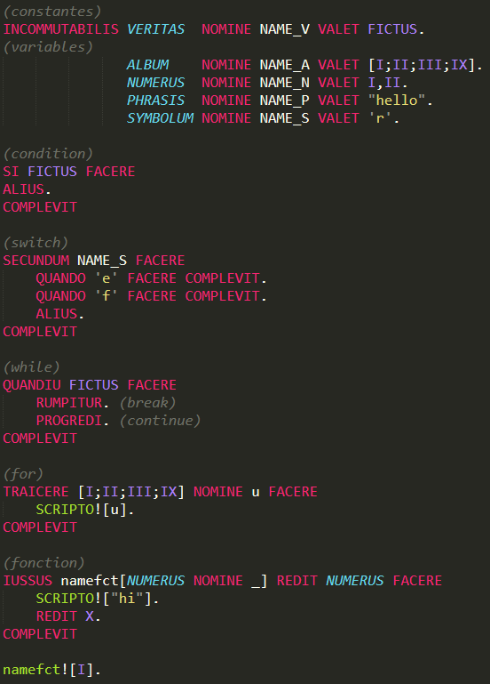

# Esoteric-language
Un language esoteric juste pour le fun

il est écrit en latin et utilise les chiffres romains
(NIHIL I V X L C D M )

les commentaires sont entre parentheses.

les instructions se finissent par un point.

5 types primitives

| Types    | equivalent |
| -------- | ---------- |
| VERITAS  | Boolean
| ALBUM    | Array
| NUMERUS  | number
| PHRASIS  | String
| SYMBOLUM | Char

les nombres sont séparé par une virgules et les elements d'un tableau par un point virgules.

les parametres de fonctions sont un tableau.
les fonctions sont appelées avec un '!'.

**Declaration**

| keyword  | fonction |
| -------- | -------  |
| NOMINE	     | nomme
| INCOMMUTABILIS | declare une constante
| VALET 		 | affect

**Controle**

| keyword   | fonction |
| --------  | -------  |
| SI        | if
| ALIUS     | else
| SECUNDUM  | switch
| QUANDO    | case
| QUANDIU   | boucle while 
| TRAICERE  | boucle for
| RUMPITUR  | break
| PROGREDI  | continue
| REDIT     | retourne
| IUSSUS    | declare une fonction
| FACERE    | commence un bloque
| COMPLEVIT | finit un bloque

**constantes**

| keyword   | fonction |
| --------  | -------  |
| FICTUS | false
| VERUM  | vrai
| NIHIL  | zero

**operateur arythmetique**

| operator  | fonction |
| --------  | -------  |
| SUP_EST   | >=
| INF_EST   | <=
| EST 		| ==
| INF 		| <
| SUP 		| >
| ->		| range

**operator_math**

| operator  | fonction |
| --------  | -------  |
| PLUS  | +
| MINUS | -
| DIV   | /
| TIME  | *
| POT   | puissance

**operateur logique**

| operator  | fonction |
| --------  | -------  |
| ET  | et 
| OR  | ou
| NOT | non
